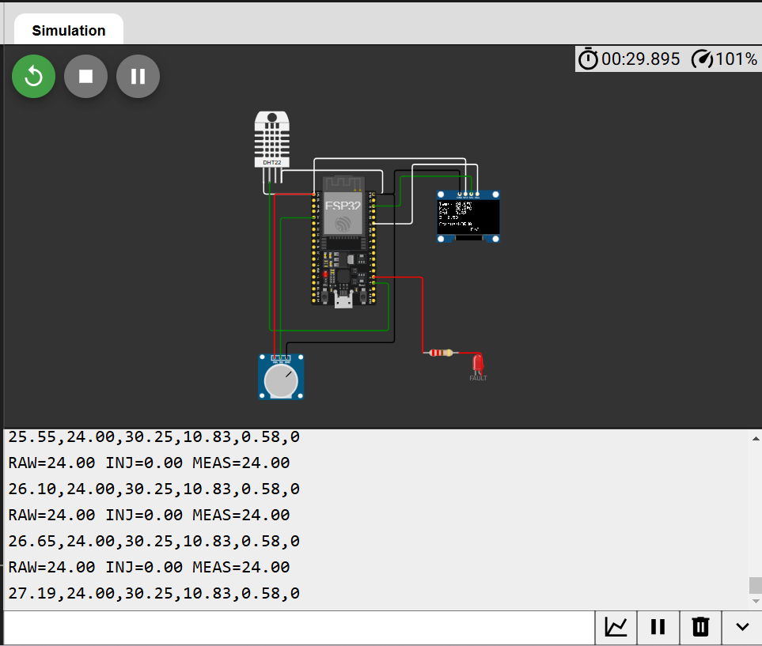
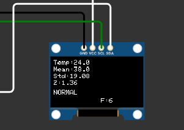
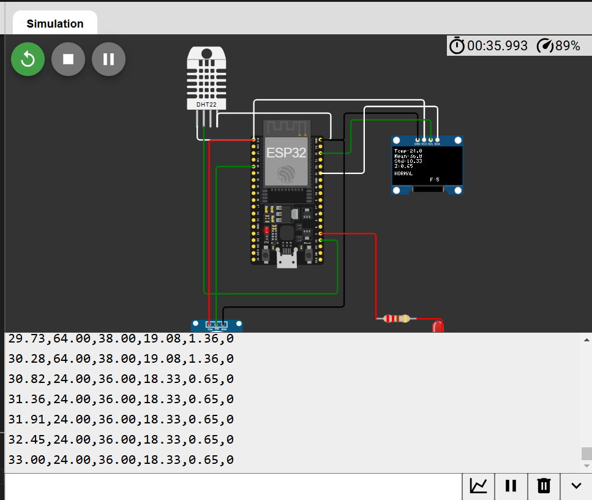
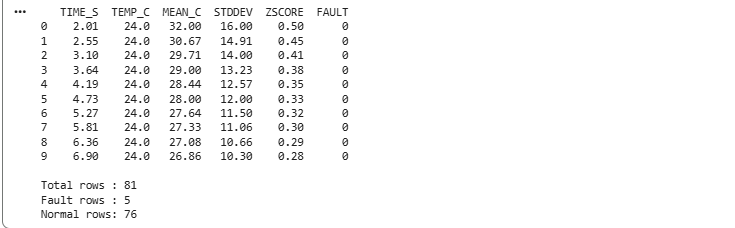
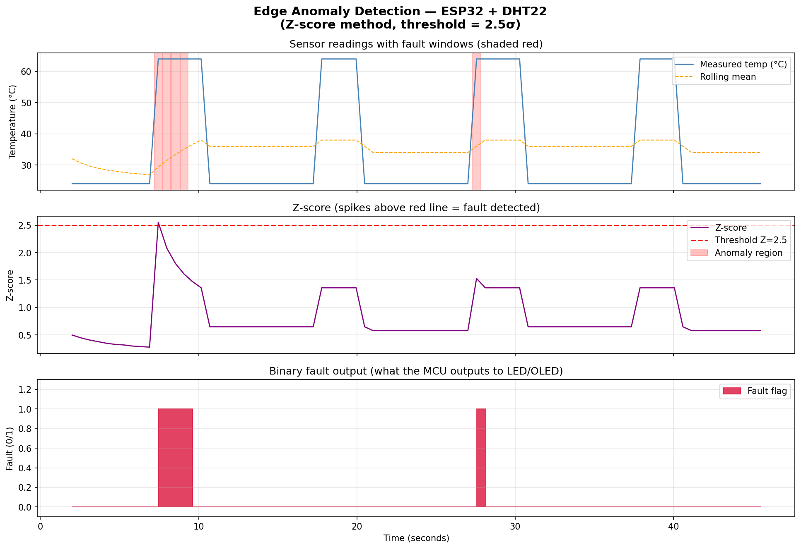
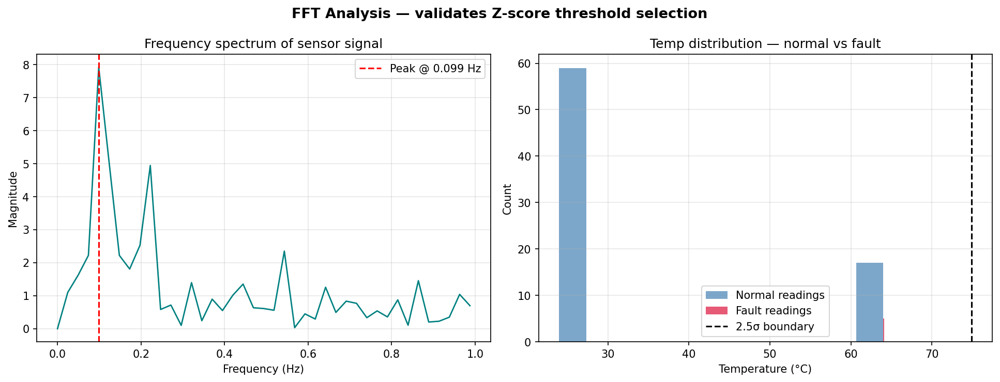

# Edge Anomaly Detection for IoT Sensor Nodes
### ESP32 + DHT22 | Edge Anomaly Detection | Wokwi + Python FFT Validation
ESP32-based edge anomaly detection system using rolling Z-score analysis, OLED fault alerts, and FFT validation in Python. Simulated with Wokwi and analyzed in Google Colab.

[](https://wokwi.com/projects/new/esp32)
[](https://colab.research.google.com/drive/1gDNLSK6C4)

---

## Problem Statement

Industrial IoT sensors fail silently — a faulty reading looks identical
to a normal one until analysed. Cloud-side detection adds 100–500 ms
of latency per alert, which is unacceptable in safety-critical systems
(motor overheating, conveyor faults, pipeline pressure anomalies).

This project implements **on-chip Z-score anomaly detection** on an
ESP32 microcontroller, eliminating cloud dependency entirely and
achieving <1 ms detection latency.

---

## Reference Paper

> Grzesiak et al., **"Online Anomaly Detection Based on Reservoir
> Sampling and LOF for IoT Devices"**, arXiv:2206.14265, 2022.

This project reproduces the paper's core concept — MCU-side anomaly
detection using statistical methods — using a lighter Z-score approach
that runs within ESP32's 520 KB SRAM.

---

## System Architecture

```
[DHT22 Sensor] ──→ [ESP32 MCU]
                      │
                      ├─ Circular buffer (20 readings)
                      ├─ Rolling mean + std dev
                      ├─ Z-score: z = |x - μ| / σ
                      ├─ If z > 2.5 → FAULT
                      │
                      ├─→ [Red LED] (fault alert)
                      ├─→ [SSD1306 OLED] (live display)
                      └─→ [Serial CSV] (logging)

[Potentiometer] ──→ Fault injection: ±20°C spike
```

---

## Results

| Metric | Value |
|---|---|
| Detection latency | < 1 ms (on-chip) |
| Z-score threshold | 2.5 σ |
| Rolling window | 20 samples |
| Sampling rate | 2 Hz (500 ms) |
| Algorithm | Rolling Z-score |
| RAM usage | ~80 bytes (20 × float) |
| Cloud dependency | None |

## Circuit Simulation



## OLED Fault Detection



## Serial Monitor Output



## CSV Data Preview



## Anomaly Detection Results



## FFT Validation



---

## File Structure

```
edge-anomaly-detection-esp32/
├── firmware/
│   └── sketch.ino          ← ESP32 firmware (C++/Arduino)
├── analysis/
│   ├── anomaly_analysis.ipynb  ← Colab notebook
│   └── sensor_log.csv          ← sample sensor data
├── results/
│
├── wokwi/
│   └── diagram.json        ← circuit definition
└── README.md
```

---

## How to Run

### Hardware simulation (Wokwi)
1. Open the [Wokwi project](https://wokwi.com/projects/466839086204344321)
2. Click the green ▶ Run button
3. Drag the potentiometer to inject temperature faults
4. Watch the OLED show "!! FAULT" and LED turn red

### Signal analysis (Colab)
1. Open the [Colab notebook](https://colab.research.google.com/drive/1gDNLSK6C4pXZKOD6vqllKm1jAn9tEGo6?usp=sharing)
2. Upload `sensor_log.csv` when prompted
3. Run all cells to generate plots

---

## Tools Used
| Tool | Purpose |
|---|---|
| [Wokwi](https://wokwi.com) | ESP32 + sensor simulation |
| Arduino C++ | Firmware / embedded logic |
| Python (NumPy, Pandas) | Signal analysis |
| Matplotlib | Visualization |
| Google Colab | Free cloud Python runtime |
| GitHub | Documentation + portfolio |

---

## Key Concepts Demonstrated
- **Rolling statistics** on a microcontroller (circular buffer)
- **Z-score anomaly detection** with configurable threshold
- **Fault injection** via analog input (potentiometer)
- **FFT validation** of threshold selection
- **Serial telemetry** for offline analysis

---

